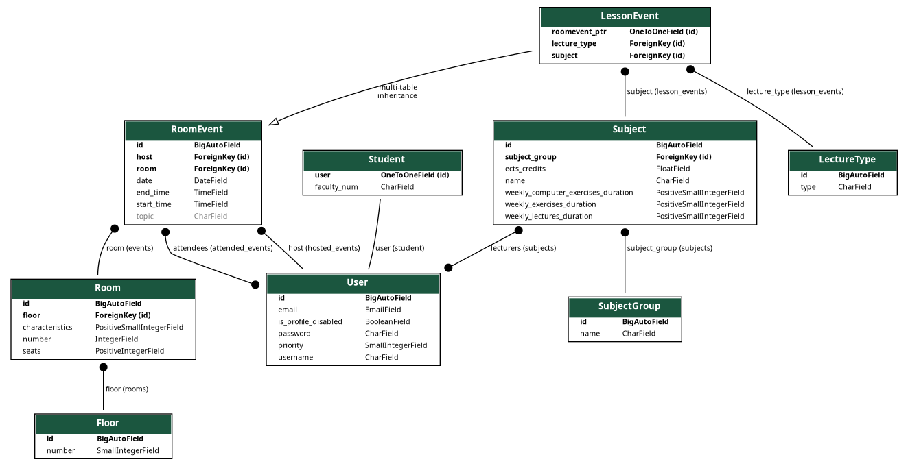
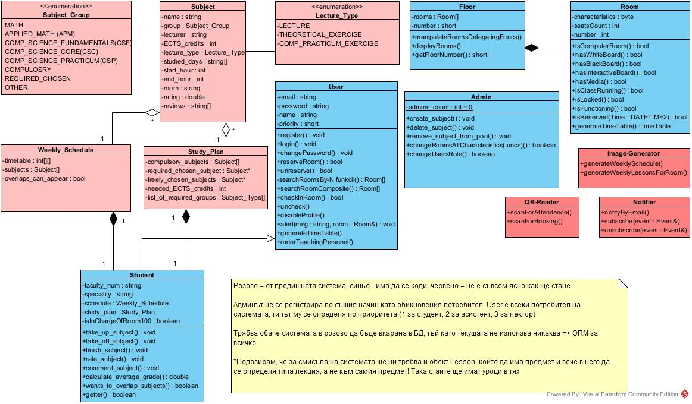

# Design and Integration of Software Systems - ПИСС
# FMI Room Scheduler

## Overview

FMI Room Scheduler is a Django-based web application for managing room reservations, lessons, and events at FMI university. It supports user registration, authentication, room and lesson search, event attendance, and more.

### Main Components

- **documentation/**: Contains diagrams and project documentation.
  - `er_diagram.png`: Entity-Relationship diagram of the database.
- **PISSDjango/app/**: Main Django app with models, views, migrations, and static files.
  - `static/html/`: HTML templates for the frontend.
  - `static/js/`: JavaScript files for frontend logic (room search, registration, etc.).
  - `views/`: Django views for API endpoints (registration, attendance, password change, etc.).
  - `migrations/`: Database migration files.
- **PISSDjango/Lib/**: Python virtual environment libraries.
- **PISSDjango/Scripts/**: Scripts for environment activation.

## Database Structure



The ER diagram above shows the main entities:
- **User**: Represents students and teachers.
- **Room**: Physical rooms available for reservation.
- **RoomEvent**: Events scheduled in rooms.
- **LessonEvent**: Lessons linked to subjects and rooms.
- **Subject**: Academic subjects.
- **Student**: Extends User with faculty number.
- **LectureType**, **Floor**, **SubjectGroup**: Supporting entities.


## How to Run

1. Install dependencies:
    ```sh
    pip install -r requirements.txt
    ```
2. Initialize the database:
    ```sh
    bash seed_db.sh
    ```
3. Start the Django server:
    ```sh
    cd PISSDjango
    python manage.py runserver
    ```
## How to Run (with virtualenv)

1. Create and activate a virtual environment:
    ```sh
    python -m venv venv
    venv\Scripts\activate   # On Windows
    # Or, on Linux/macOS:
    # source venv/bin/activate
    ```

2. Install dependencies:
    ```sh
    pip install -r requirements.txt
    ```

3. Initialize the database:
    ```sh
    bash seed_db.sh
    ```

4. Start the Django server:
    ```sh
    cd PISSDjango
    python manage.py runserver
    ```

---
## Usage

- Register and log in via the web interface.
- Search for rooms and lessons.
- Reserve rooms and attend events.
- Change password and manage your profile.
- Categorizing and sorting rooms.
- QR code for attendance.
---

For more details, see the [documentation](documentation/).
